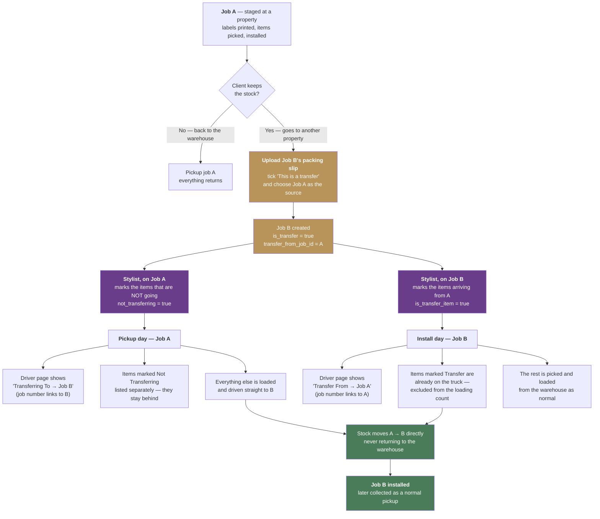

# How a transfer works today

## The two flags, and why both exist

| Flag | Set on | Means |
|---|---|---|
| `is_transfer` + `transfer_from_job_id` | **Job B** (the receiving job) | This whole job draws stock from Job A |
| `not_transferring` | items on **Job A** | Stays at the property / returns to the warehouse — not part of the move |
| `is_transfer_item` | items on **Job B** | Arrives from A, already on the truck — don't load it from the warehouse |

The link is recorded on B only. A knows it is sending stock because another
job points at it — which is why the "Transferring To" banner is a lookup
rather than a stored field.

## Where it shows up

| Screen | What it shows |
|---|---|
| Driver — Job A (pickup) | "Transferring To → B", Not Transferring items listed apart |
| Driver — Job B (install) | "Transfer From → A", transfer items excluded from the load count |
| Scheduler tile | TRANSFER FROM / TO, with the partner's reference and street |
| Team view card | ⇄ Transfer from / to, same wording |
| Summary PDF | transfer markings per item, splitting repeat groups |

## Known gaps

- **Nothing verifies the two sides agree.** If Job A has no items marked
  not-transferring and B has none marked as transfers, the link still
  exists but no stock is actually accounted for as moving.
- **A chain works but isn't shown as one.** A → B → C is two separate
  links; no screen shows the full chain.
- **Only one source per job.** Job B can draw from exactly one job.
